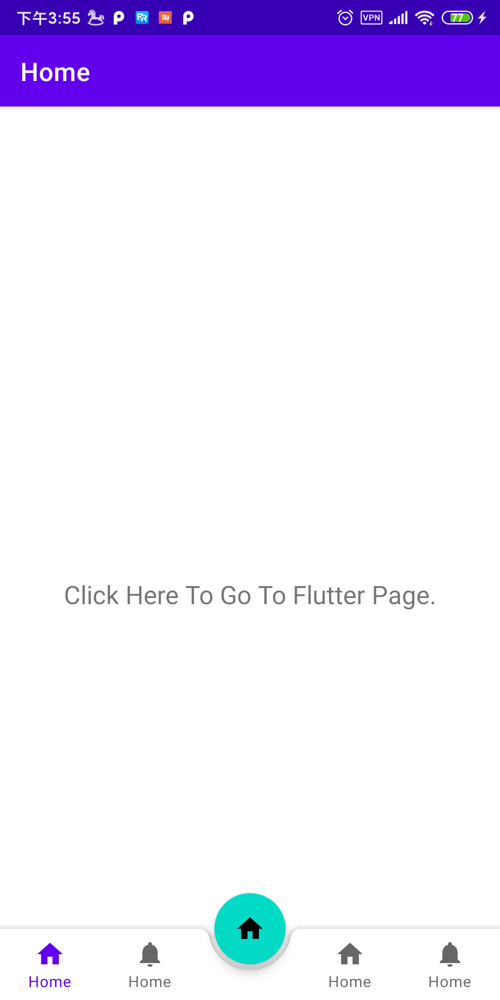

# Android Project With Flutter Module

### env

```
Android Studio 4.0.1
------------------------------------------------------------
Gradle 6.1.1
------------------------------------------------------------

Build time:   2020-01-24 22:30:24 UTC
Revision:     a8c3750babb99d1894378073499d6716a1a1fa5d

Kotlin:       1.3.61
Groovy:       2.5.8
Ant:          Apache Ant(TM) version 1.10.7 compiled on September 1 2019
JVM:          1.8.0_121 (Oracle Corporation 25.121-b13)
OS:           Mac OS X 10.13.6 x86_64
```



